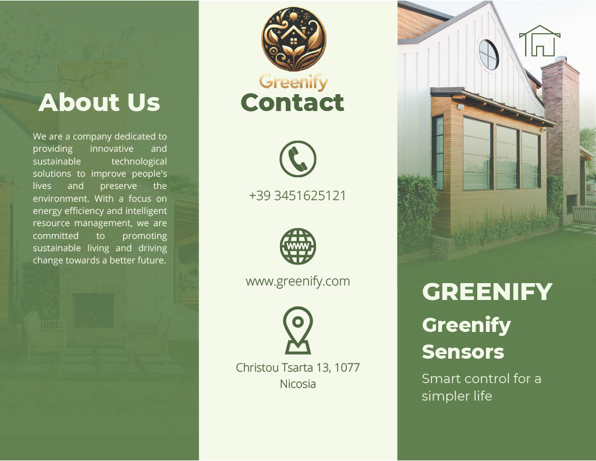

<!-- Banner Image -->

  <!--"https://stateimpactcenter.org/images/general/_full/Blog-Powering-Up-for-a-Clean-Energy-Transition-10-12-23.jpg" width="100%">-->

# Greenify
Greenify's mission is to revolutionize household energy management by harnessing artificial intelligence to significantly reduce carbon emissions and promote environmental sustainability. Our innovative AI-driven platform not only empowers homeowners to optimize energy usage for cost savings but also contribute to a healthier planet and enhances comfort and well-being within homes. By integrating cutting-edge technology with eco-conscious strategies, Greenify aspires to set a global standard for intelligent, sustainable living, making eco-friendly choices accessible and effortless for everyone.
Through the seamless integration of AI algorithms, advanced sensors, and smart devices, our platform empowers homeowners to effortlessly monitor, control, and optimize their energy usage in real-time. By analyzing various data points like consumption patterns, building characteristics, utility rates and weather forecasts, Greenify's system dynamically optimizes energy consumption, balancing cost savings with eco-friendly choices, setting a new global standard for intelligent, sustainable living.
Greenify's innovation extends beyond current smart home technologies by deeply integrating AI with renewable energy sources to dynamically manage and optimize household energy systems. This approach enables precise, real-time adjustments to energy consumption, prioritizing renewable energy use and storage. The technological breakthrough lies in the platform's ability to seamlessly predict and align energy needs with the availability of solar and wind power, effectively reducing carbon footprint and fostering a sustainable, energy-efficient lifestyle. This dual capability of enhancing energy efficiency while promoting renewable resource utilization represents a significant leap in smart energy management.
